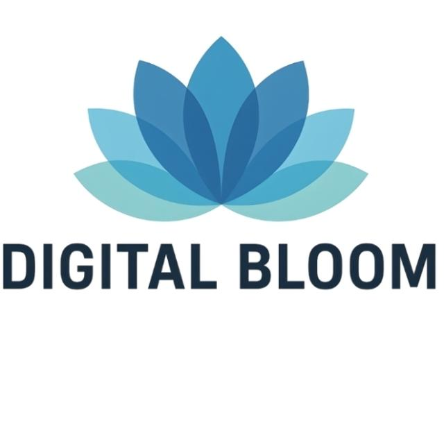

<!-- HEADER BANNER -->
<div align="center">

#  DigitalBloom AI Programme
### *Empowering Communities with Future-Ready Artificial Intelligence Skills*

**Delivered by [Stratetactical Solutions Limited (STL)](mailto:stratetacticallimited@gmail.com) · Kenya**

[](./LICENCE.md)
[](./PROGRAMME.md)
[](./SUPPORT.md)
[]()

---

> *"We believe AI literacy is not a privilege — it is a right. DigitalBloom exists to make sure no community is left behind in the AI revolution."*
>
> — **Mr. Eric Muhoro Muchiri**, CTO & AI Engineer, Stratetactical Solutions Limited

</div>

---

## 🌍 What is DigitalBloom?

**DigitalBloom** is a comprehensive, multi-disciplinary Artificial Intelligence capacity building programme developed and delivered by **Stratetactical Solutions Limited (STL)**. It is designed to equip professionals, students, leaders, community members, and organisations with **practical, future-ready AI skills** — regardless of their technical background.

DigitalBloom is **open in spirit and community-driven.**

We run the programme commercially for institutions that can sustain it, and at **little or no cost** for communities, grassroots organisations, faith-based groups, and underserved populations. This repository is the resource mobilisation hub for our community and donor-supported programmes.

---

## 🎯 The Problem We Are Solving

Across Africa and the developing world:

- **Millions of graduates** are entering a job market that increasingly demands AI literacy — without having received any AI training
- **Community organisations, churches, NGOs, and local governments** lack the internal capacity to integrate AI into their work
- **Women, youth, and rural communities** are disproportionately excluded from the digital transformation conversation
- **Educational institutions** want to teach AI but lack curriculum expertise and qualified facilitators
- **AI tools are proliferating faster** than the capacity to use them responsibly, ethically, and effectively

DigitalBloom exists to close this gap — one community, one cohort, one session at a time.

---

## 📚 Programme Overview

The DigitalBloom AI Programme spans **30 courses** across **11 thematic areas**, structured into progressive series of **5 sessions × 3 hours each**.

| # | Thematic Area | Sample Courses |
|---|---|---|
| 1 | Executive & Administrative Excellence | Advanced Executive Assistant Masterclass; AI Essentials for Office Managers |
| 2 | Leadership, Governance & Transformation | AI for Leaders & Managers; AI Governance & Risk Leadership |
| 3 | Human Resources & Talent Development | AI in HRM; AI-Driven Talent Management; HR Masterclass |
| 4 | Finance, Procurement & Operations | AI in Accounting & Finance; AI for Procurement & Supply Chain |
| 5 | Communication, Media & Branding | AI-Powered PR/Journalism/Communications; Business Writing in the Age of AI |
| 6 | Marketing, Customer Experience & Career Growth | AI-Powered Marketing & CRM; AI-Powered Career Management |
| 7 | Creativity, Media & Design | AI-Powered Entertainment, Art and Design |
| 8 | Core AI & Technical Foundations | Fundamentals of AI; AI Tools Training; AI-Powered Data Science |
| 9 | Advanced AI Engineering & Agentic Systems | AI-Powered Agentic Engineering; Agentic AI Specialization |
| 10 | Project & Professional Development | AI-Powered Project Management; AI Tools Training |
| 11 | Human-Centred AI Skills | Emotional Intelligence in the AI Era; AI Ethics and Guardrails |

> **Prompt Engineering** is embedded at Basic, Intermediate, and Advanced levels across **all** courses.

📄 See [CURRICULUM.md](./CURRICULUM.md) for the full programme structure.

---

## 🏅 Certification Pathway

Learners progress through four levels of certification:

```
🟢 Foundation       →   🔵 Professional   →   🟣 Expert   →   🏆 Specialist
AI Literacy &           Applied AI in           Advanced AI     Agentic Systems &
Core Skills             Business Functions      Systems &       Innovation Leadership
                                                Strategy
```

Each level awards a **DigitalBloom Digital Certificate** with a verifiable badge — recognised by employers and institutions.

📄 See [CERTIFICATION.md](./CERTIFICATION.md) for full details.

---

## 🤝 Who We Serve (Community Track)

DigitalBloom's community programme targets groups that face the highest barriers to AI access:

| Target Group | What We Offer |
|---|---|
| 🎓 **Youth & Students** | Free or subsidised AI literacy sessions at schools, colleges & universities |
| 👩 **Women & Girls** | Gender-focused AI empowerment cohorts in partnership with women's groups |
| ⛪ **Faith-Based Organisations** | AI for community service, administration, communications & outreach |
| 🏘️ **Community Organisations** | AI tools for project management, reporting, fundraising & advocacy |
| 🏛️ **Local Government Units** | AI for public service delivery, data management & citizen engagement |
| 🌾 **Rural & Underserved Communities** | Accessible, context-relevant AI training in local languages where possible |
| 🧑‍💼 **Job Seekers & Informal Workers** | AI career tools, CV enhancement, and freelance capability building |
| 🏥 **Health & Social Service Workers** | AI for documentation, patient communication & resource allocation |

---

## 🆓 Free Pilot Sessions — Our FCRM Promise

Before any community cohort begins, STL provides a **free pilot session** as part of our **Feedback, Complaint, and Response Mechanism (FCRM)**.

This means:
- ✅ The community experiences the programme quality first-hand at zero cost
- ✅ Participants give structured feedback that shapes the full programme
- ✅ No community is locked into anything before they are satisfied
- ✅ STL calibrates delivery to the specific cultural and contextual needs of each group

> **We do not ask communities to commit before they have experienced the value.**

---

## 💰 Support DigitalBloom — Resource Mobilisation

DigitalBloom is open in spirit and community-driven.

If this programme creates value for you, your organisation, or the communities you serve, you can support its continued growth through the channels below. Every contribution — large or small — directly funds free and subsidised AI training for communities that cannot afford it.

### 📊 What Your Support Funds

| Your Support Enables | Impact |
|---|---|
| 🖥️ **Facilitator time & preparation** | Each free community session requires 6–10 hours of facilitator preparation, delivery, and follow-up |
| 📦 **Training materials & resources** | Handouts, prompt guides, tool access subscriptions, and participant workbooks |
| 🌐 **Platform & tool access costs** | Paid AI tool licences (Synthesia, Midjourney, Jasper, etc.) provided to participants during sessions |
| 🏫 **Venue & logistics support** | Transport, setup, and refreshment costs for in-person community sessions |
| 🌍 **Geographic expansion** | Taking DigitalBloom to new communities, counties, and countries |
| 🌸 **Curriculum development** | Continuously updating the 30-course curriculum to reflect the fastest-moving field in the world |
| 📜 **Free certifications** | Issuing verifiable digital certificates and badges to community learners at no cost to them |
| 👩‍🏫 **Facilitator training & development** | Training local community members to become DigitalBloom facilitators — multiplying impact |
| 🗣️ **Local language adaptation** | Translating and contextualising content for non-English speaking communities |
| 📡 **Connectivity & device support** | Providing data bundles and device access for participants in low-connectivity areas |

---

### 🌐 International Donors & Organisations

#### PayPal — Grants & Sponsorships

| Type | Link |
|---|---|
| 🏛️ **Grant / Institutional Support** | [Donate via PayPal →](https://www.paypal.com/ncp/payment/8ZABR9A9BC5GQ) |
| 💼 **Full Project Sponsorship** | [Sponsor via PayPal →](https://www.paypal.com/ncp/payment/L5RMGYMNXYCRG) |
| 🧪 **Paid Pilot Session** | [Fund a Pilot via PayPal →](https://www.paypal.com/ncp/payment/4MJZ65WKJVHXG) |

#### 🏦 Swift / Bank Transfer

For institutional donors, foundations, and government grants:

| Field | Details |
|---|---|
| **Bank** | NCBA Bank Kenya PLC |
| **Account Name** | Stratetactical Solutions Limited |
| **Account Number** | 1002892619 |
| **Swift Code** | CBAFKENX |
| **Bank Code** | 07 |
| **Branch Code** | 000 |

> Please email **stratetacticallimited@gmail.com** after your transfer so we can acknowledge your gift and provide a formal receipt.

---

### 🇰🇪 Kenya-Based Supporters

#### M-PESA Paybill (Lipa na M-PESA)

```
Paybill Number : 880100
Account Number : 1002892619
```

Send any amount via M-PESA and SMS **+254 742 954 736** or **+254 758 513 955** with your name for acknowledgement.

---

### 🤲 Sponsorship Tiers

| Tier | Contribution | What It Funds |
|---|---|---|
| 🌱 **Seed Supporter** | KES 1,000 / USD 10 | Training materials for one participant |
| 🌿 **Community Champion** | KES 5,000 / USD 40 | One full free community session (15–20 participants) |
| 🌸 **Programme Partner** | KES 25,000 / USD 200 | A full 5-session series for a community cohort |
| 🌺 **Impact Sponsor** | KES 100,000 / USD 750 | Full programme track for a community organisation |
| 🏆 **Transformation Donor** | KES 500,000+ / USD 3,500+ | Full institutional community programme deployment |

> All tiers receive acknowledgement, a donor report, and impact data. Senior tiers receive co-branding on programme materials.

---

## 📬 Contact & Partnership Enquiries

| | |
|---|---|
| **Lead Contact** | Mr. Eric Muhoro Muchiri — CTO & AI Engineer |
| **Organisation** | Stratetactical Solutions Limited (STL) |
| **Email** | stratetacticallimited@gmail.com |
| **Phone / WhatsApp** | +254 742 954 736 |
| **Alternative** | +254 758 513 955 |
| **Programme Reference** | STL/DGBLM/CB/AI/26/01 |

---

## 📁 Repository Structure

```
digitalbloom/
├── README.md               ← You are here — Programme overview & donor hub
├── CURRICULUM.md           ← Full 30-course programme structure
├── CERTIFICATION.md        ← Certification framework & progression pathway
├── COMMUNITY.md            ← Community programme details & eligibility
├── SUPPORT.md              ← Full donor & support information
├── IMPACT.md               ← Impact stories, data & beneficiary reports
├── PARTNERS.md             ← Current partners & collaboration opportunities
├── FACILITATORS.md         ← Facilitator guide & how to join the team
├── FAQ.md                  ← Frequently asked questions
└── LICENCE.md              ← Open community licence terms
```

---

## 🔖 Quick Links

| | |
|---|---|
| 📄 Full Curriculum | [CURRICULUM.md](./CURRICULUM.md) |
| 🏅 Certification | [CERTIFICATION.md](./CERTIFICATION.md) |
| 💰 Support / Donate | [SUPPORT.md](./SUPPORT.md) |
| 🌍 Community Programme | [COMMUNITY.md](./COMMUNITY.md) |
| 🤝 Become a Partner | [PARTNERS.md](./PARTNERS.md) |
| 📊 Our Impact | [IMPACT.md](./IMPACT.md) |
| ❓ FAQ | [FAQ.md](./FAQ.md) |

---

<div align="center">

*DigitalBloom is a programme of Stratetactical Solutions Limited (STL)*
*Professional, Scientific and Technical Services · Kenya*

**🌸 Empowering Your Digital Transformation — One Community at a Time**

</div>
